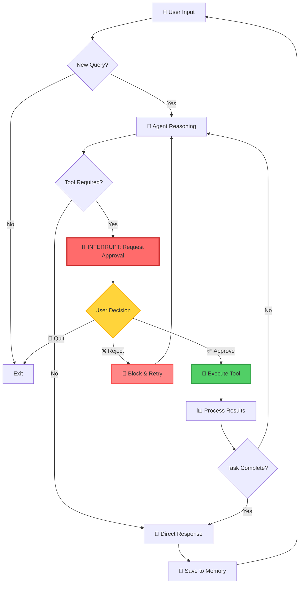

# 🤖 MCP Tools with Human-in-the-Loop Agent

[](https://www.python.org/downloads/)
[](https://langchain.com/)
[](https://langchain-ai.github.io/langgraph/)
[](LICENSE)

> **An intelligent AI agent with Human-in-the-Loop (HITL) security controls, combining MCP (Model Context Protocol) tools with custom capabilities for safe, interactive task execution.**

---

## 📋 Table of Contents

- [Overview](#-overview)
- [Key Features](#-key-features)
- [Architecture](#-architecture)
- [Workflow Pipeline](#-workflow-pipeline)
- [Technical Stack](#-technical-stack)
- [Installation](#-installation)
- [Configuration](#-configuration)
- [Usage](#-usage)
- [Security Features](#-security-features)
- [Tool Ecosystem](#-tool-ecosystem)
- [Project Structure](#-project-structure)
- [Authors](#-authors)
- [Contributing](#-contributing)
- [License](#-license)

---

## 🎯 Overview

This project implements a **ReAct (Reasoning + Acting) agent** powered by Google's Gemini AI, featuring a unique **Human-in-the-Loop (HITL)** approval system. Before executing any tool, the agent requests explicit user permission, ensuring complete control over AI actions.

### What Makes This Special?

- 🛡️ **Security First**: Every tool execution requires human approval
- 🔌 **Extensible**: Seamlessly integrates MCP servers and custom tools
- 💬 **Conversational**: Multi-turn dialogue with memory persistence
- 🧮 **Hybrid Capabilities**: Combines web scraping, search, and computation
- 🔄 **Stateful**: Maintains conversation context across interactions

---

## ✨ Key Features

| Feature | Description |
|---------|-------------|
| 🔐 **HITL Security** | Interrupt-before-execution pattern for all tool calls |
| 🌐 **Web Intelligence** | Firecrawl integration for web scraping and search |
| 🧮 **Math Engine** | Built-in calculator with safe expression evaluation |
| 💾 **Memory Management** | Persistent conversation state using LangGraph checkpointing |
| 🔧 **Dynamic Tools** | Automatic tool discovery and registration |
| ⚡ **Async Architecture** | Non-blocking I/O for efficient execution |
| 🎨 **Rich CLI** | Beautiful terminal interface with formatted outputs |

---

## 🏗️ Architecture

```
┌─────────────────────────────────────────────────────────────┐
│                        USER INTERFACE                        │
│                    (Interactive CLI)                         │
└────────────────────────┬────────────────────────────────────┘
                         │
                         ▼
┌─────────────────────────────────────────────────────────────┐
│                    LANGGRAPH AGENT                           │
│  ┌──────────────────────────────────────────────────────┐   │
│  │         ReAct Agent (Reasoning + Acting)             │   │
│  │  • Gemini 2.5 Flash LLM                              │   │
│  │  • System Prompt Engineering                         │   │
│  │  • Memory Checkpointing                              │   │
│  └──────────────────────────────────────────────────────┘   │
└────────────────────────┬────────────────────────────────────┘
                         │
                         ▼
┌─────────────────────────────────────────────────────────────┐
│              🛡️ SECURITY LAYER (HITL)                       │
│  ┌──────────────────────────────────────────────────────┐   │
│  │  Interrupt Before Tools Execution                    │   │
│  │  • Display tool name & arguments                     │   │
│  │  • Request user approval (y/n/q)                     │   │
│  │  • Block or allow execution                          │   │
│  └──────────────────────────────────────────────────────┘   │
└────────────────────────┬────────────────────────────────────┘
                         │
                         ▼
┌─────────────────────────────────────────────────────────────┐
│                    TOOL ECOSYSTEM                            │
│  ┌─────────────────────┐    ┌──────────────────────────┐    │
│  │   MCP TOOLS         │    │   CUSTOM TOOLS           │    │
│  │                     │    │                          │    │
│  │ • firecrawl_search  │    │ • calculator             │    │
│  │ • firecrawl_scrape  │    │   (safe eval)            │    │
│  │                     │    │                          │    │
│  └─────────────────────┘    └──────────────────────────┘    │
└────────────────────────┬────────────────────────────────────┘
                         │
                         ▼
┌─────────────────────────────────────────────────────────────┐
│                  EXTERNAL SERVICES                           │
│  • Firecrawl API (Web Scraping)                              │
│  • Google Gemini API (LLM)                                   │
└─────────────────────────────────────────────────────────────┘
```

---

## 🔄 Workflow Pipeline



### Execution Flow Explained

1. **Input Phase**: User submits a query through the CLI
2. **Reasoning Phase**: Gemini LLM analyzes the query and determines required actions
3. **Security Gate**: If a tool is needed, execution pauses for human approval
4. **Decision Point**: User can approve (y), reject (n), or quit (q)
5. **Execution Phase**: Approved tools run and return results
6. **Response Phase**: Agent synthesizes results into a natural language response
7. **Memory Phase**: Conversation state is persisted for context continuity

---

## 🛠️ Technical Stack

### Core Framework
- **LangChain** - LLM orchestration and tool management
- **LangGraph** - Stateful agent workflows with checkpointing
- **LangChain MCP Adapters** - Model Context Protocol integration

### AI Model
- **Google Gemini 2.5 Flash** - Fast, efficient reasoning engine

### Tools & Services
- **Firecrawl MCP** - Web scraping and search capabilities
- **Custom Calculator** - Safe mathematical expression evaluation

### Infrastructure
- **Python 3.8+** - Core runtime
- **asyncio** - Asynchronous execution
- **python-dotenv** - Environment configuration

---

## 📦 Installation

### Prerequisites
- Python 3.10 or higher
- Node.js (for MCP server execution)
- Google API Key (Gemini)
- Firecrawl API Key (optional)

### Step-by-Step Setupaaa

1. **Clone the Repository**
   ```bash
   git clone https://github.com/SahiL911999/MCP-Tools-with-Human-in-the-Loop-Agent.git
   cd MCP-Tools-with-Human-in-the-Loop-Agent
   ```

2. **Create Virtual Environment**
   ```bash
   python -m venv virenv
   
   # Windows
   virenv\Scripts\activate
   
   # Linux/Mac
   source virenv/bin/activate
   ```

3. **Install Dependencies**
   ```bash
   pip install -r requirements.txt
   ```

4. **Configure Environment Variables**
   ```bash
   # Create .env file
   cp .env.example .env
   
   # Edit .env with your API keys
   GOOGLE_API_KEY=your_gemini_api_key_here
   FIRECRAWL_API_KEY=your_firecrawl_api_key_here
   ```

---

## ⚙️ Configuration

### Environment Variables

| Variable | Required | Description |
|----------|----------|-------------|
| `GOOGLE_API_KEY` | ✅ Yes | Google Gemini API key for LLM access |
| `FIRECRAWL_API_KEY` | ⚠️ Optional | Firecrawl API key for web scraping |

### MCP Server Configuration

The agent uses the following MCP server setup:

```python
mcp_servers = {
    "firecrawl-mcp": {
        "command": "npx.cmd",           # Windows: npx.cmd, Linux/Mac: npx
        "args": ["-y", "firecrawl-mcp"],
        "env": {"FIRECRAWL_API_KEY": os.getenv("FIRECRAWL_API_KEY")},
        "transport": "stdio",
    }
}
```

### System Prompt Customization

Modify the `SYSTEM_PROMPT` variable in `agent.py` to adjust agent behavior:

```python
SYSTEM_PROMPT = """You are a helpful AI assistant with access to multiple tools.
[Your custom instructions here]
"""
```

---

## 🚀 Usage

### Starting the Agent

```bash
python agent.py
```

### Example Interactions

#### 1️⃣ Web Search with Approval
```
You: Search for the latest AI news

╔════════════════════════════════════════════════════════════
║ SECURITY INTERRUPT: TOOL APPROVAL REQUIRED
╠════════════════════════════════════════════════════════════
║ TOOL:       firecrawl_search
║ ARGUMENTS:  {'query': 'latest AI news', 'sources': [{'type': 'web'}], 'limit': 2}
╚════════════════════════════════════════════════════════════

Approve this action? (y/n/q): y
Approved. Executing tool...

Agent: Here are the latest AI developments...
```

#### 2️⃣ Mathematical Calculation
```
You: Calculate (125 + 75) * 3 / 2

╔════════════════════════════════════════════════════════════
║ SECURITY INTERRUPT: TOOL APPROVAL REQUIRED
╠════════════════════════════════════════════════════════════
║ TOOL:       calculator
║ ARGUMENTS:  {'expression': '(125 + 75) * 3 / 2'}
╚════════════════════════════════════════════════════════════

Approve this action? (y/n/q): y
Approved. Executing tool...

Agent: The result is 300.0
```

#### 3️⃣ Rejecting a Tool Call
```
You: Scrape https://example.com

╔════════════════════════════════════════════════════════════
║ SECURITY INTERRUPT: TOOL APPROVAL REQUIRED
╠════════════════════════════════════════════════════════════
║ TOOL:       firecrawl_scrape
║ ARGUMENTS:  {'url': 'https://example.com'}
╚════════════════════════════════════════════════════════════

Approve this action? (y/n/q): n
Rejected. Tool call blocked.

Agent: I understand you don't want me to scrape that site. 
       Is there another way I can help you?
```

### Commands

| Command | Action |
|---------|--------|
| `y` | Approve tool execution |
| `n` | Reject tool execution |
| `q` | Quit the session |
| `quit` / `exit` | Exit the agent |

---

## 🔒 Security Features

### Human-in-the-Loop (HITL) Pattern

The agent implements a **mandatory approval gate** before any tool execution:

```python
interrupt_before=["tools"]  # Pauses execution before tool calls
```

### Benefits

1. **Prevent Unintended Actions**: User reviews every operation
2. **Cost Control**: Avoid expensive API calls
3. **Data Privacy**: Block unauthorized data access
4. **Audit Trail**: Transparent operation logging
5. **Learning Mode**: Understand agent decision-making

### Safe Calculator Implementation

The custom calculator uses restricted `eval()` with:
- ✅ Whitelisted functions only (abs, round, min, max, sum, pow)
- ✅ No access to `__builtins__`
- ✅ Exception handling for malformed expressions
- ❌ No file system access
- ❌ No network operations
- ❌ No code execution beyond math

---

## 🧰 Tool Ecosystem

### MCP Tools (Firecrawl)

#### `firecrawl_search`
- **Purpose**: Search the web for information
- **Parameters**:
  - `query` (str): Search query
  - `sources` (list): Must be `[{"type": "web"}]`
  - `limit` (int): Number of results (recommended: 1-2)

#### `firecrawl_scrape`
- **Purpose**: Extract content from a specific URL
- **Parameters**:
  - `url` (str): Target webpage URL

### Custom Tools

#### `calculator`
- **Purpose**: Evaluate mathematical expressions
- **Supported Operations**: `+`, `-`, `*`, `/`, `//`, `%`, `**`, `()`
- **Supported Functions**: `abs`, `round`, `min`, `max`, `sum`, `pow`
- **Example**: `calculator("pow(2, 10) + 100")` → `1124`

### Adding New Tools

To add custom tools:

```python
@tool
def my_custom_tool(param: str) -> str:
    """Tool description for the LLM"""
    # Implementation
    return result

# Add to tools list
all_tools = mcp_tools + [calculator, my_custom_tool]
```

---

## 📁 Project Structure

```
mcptools_interrupt_hitl/
│
├── virenv/                    # Virtual environment (excluded from git)
│   ├── Include/
│   ├── Lib/
│   ├── Scripts/
│   └── pyvenv.cfg
│
├── agent.py                   # Main agent implementation
├── requirements.txt           # Python dependencies
├── .env                       # Environment variables (excluded from git)
├── .gitignore                 # Git exclusions
└── README.md                  # This file
```

### Key Files

- **agent.py**: Core agent logic with HITL implementation
- **requirements.txt**: All Python package dependencies
- **.env**: API keys and configuration (keep private!)
- **.gitignore**: Prevents sensitive files from being committed

---

## 👥 Authors

<table>
  <tr>
    <td align="center">
      <br />
      <sub><b>Sahil Ranmbail</b></sub><br />
      <a href="https://github.com/SahiL911999">🔗 GitHub</a>
    </td>
  </tr>
</table>

**Sahil Ranmbail** - *AI Engineer*
- Designed the Human-in-the-Loop security pattern
- Implemented MCP integration and custom tool ecosystem
- Created the ReAct agent workflow with LangGraph

---

## 🤝 Contributing

Contributions are welcome! Here's how you can help:

1. **Fork the Repository**
2. **Create a Feature Branch**
   ```bash
   git checkout -b feature/amazing-feature
   ```
3. **Commit Your Changes**
   ```bash
   git commit -m "Add amazing feature"
   ```
4. **Push to Branch**
   ```bash
   git push origin feature/amazing-feature
   ```
5. **Open a Pull Request**

### Development Guidelines

- Follow PEP 8 style guidelines
- Add docstrings to all functions
- Test new tools thoroughly
- Update README for new features
- Maintain HITL security pattern

---

## 📄 License

This project is licensed under the MIT License - see the [LICENSE](LICENSE) file for details.

---

## 🙏 Acknowledgments

- **LangChain Team** - For the incredible LLM framework
- **Google** - For Gemini API access
- **Firecrawl** - For web scraping capabilities
- **Open Source Community** - For continuous inspiration

---

## 📞 Support

For questions, issues, or feature requests:

- 🐛 [Open an Issue](../../issues)
- 💬 [Start a Discussion](../../discussions)
- 📧 Contact: [Your Email]

---

## 🔮 Future Roadmap

- [ ] Add more MCP server integrations
- [ ] Implement web UI with Gradio/Streamlit
- [ ] Add conversation export functionality
- [ ] Create Docker containerization
- [ ] Add unit tests and CI/CD pipeline
- [ ] Implement role-based access control
- [ ] Add tool usage analytics dashboard

---

<div align="center">

**⭐ Star this repo if you find it useful! ⭐**

Made with ❤️ by Sahil Ranmbail

</div>
